# Especificação das Telas: Site SOS Patas

> Protótipo navegável: [index.html](index.html) (abrir no navegador; botão **"☰ Telas do protótipo"** no canto inferior esquerdo).
> Prints de cada tela (celular e computador): [telas/](telas/). Para gerar de novo: `python prototipo/gerar_prints.py`.
> Regras de negócio (RN) e modelo de dados: [../DESENVOLVIMENTO.md](../docs/DESENVOLVIMENTO.md).
>
> **Ao desenvolver em React, cada tela abaixo vira uma página. Reaproveitar as classes Tailwind e os tokens de design do protótipo.**

**Status de validação:** ⏳ aguardando a ONG · ✅ validada · ✏️ ajustar

---

## Identidade visual

Baseada no logo e nos posts do Instagram @sospatas.ong.

| Token | Cor | Uso |
|---|---|---|
| `azul` | `#1F3E9C` | Cor principal: cabeçalhos, botões principais, títulos |
| `azul-escuro` | `#152B70` | Textos de título, rodapé, cabeçalho da área da ONG |
| `azul-claro` | `#E8EDFB` | Fundos de destaque e tags |
| `vermelho` | `#E02A2F` | Urgência: "Esperando há mais tempo", doação, excluir |
| `amarelo` | `#F5A623` | Botão principal da página inicial, avisos |
| `fundo` | `#F6F7FB` | Fundo das páginas |
| WhatsApp | `#25D366` | Somente no botão "Quero adotar" |

- **Fontes:** *Baloo 2* para títulos (arredondada, lembra os cartazes da ONG) e *Nunito* para textos (Google Fonts).
- **Logo oficial:** [assets/logo.png](assets/logo.png), **790 × 790 px, PNG, cerca de 60 KB**, recebida da ONG em 06/10/2026 em boa resolução (substituiu o recorte do Instagram). Original guardado em `fotos/WhatsApp Image 2026-10-06 at 12.53.59.jpeg`, fora do Git. Para gerar de novo: recortar as bordas brancas, deixar quadrado com 4% de margem branca e reduzir a paleta para 32 cores.
  - **Usar sempre este arquivo** em todas as telas (cabeçalho, rodapé, login, missão), sem redesenhar, distorcer nem trocar as cores. A logo é quadrada com fundo branco; em fundo escuro, colocar sobre um quadrado branco com cantos arredondados (como no rodapé).
  - **Cores da logo:** azul `#0F009B` e vermelho `#E71B24`. Os tokens `azul` e `vermelho` do site são próximos, mas não iguais. _(A decidir: alinhar os tokens às cores da logo.)_
- **Cantos arredondados** (`rounded-2xl` nos cards, `rounded-xl` nos botões); botões com pelo menos 44 px de altura.
- **Tom acolhedor, não empresarial** (pedido de 07/10/2026). Aplicado primeiro na página inicial (T01), para estender às outras páginas públicas:
  - **Patinhas** (`icone.pata`) como elemento de marca: duas patinhas amarelas logo depois do título da chamada; trilha de patinhas brancas e transparentes "caminhando" pelo fundo azul; patinha antes dos chapéus das seções ("Quem somos", "Nossa missão", "Eles precisam de você", "Passo a passo"); patinhas no lugar das bolinhas da linha do tempo; patinhas grandes e transparentes no card de doação; patinha colorida acima de cada número em destaque.
  - **Fotos como polaroides:** moldura branca, levemente inclinadas (±3°), com selo de patinha (amarelo) e de coração (vermelho).
  - **Formas suaves:** botões principais em pílula (`rounded-full`), cards maiores com `rounded-3xl` e borda ondulada (SVG) no fim da faixa azul, em vez de corte reto.
  - Decoração sempre com `aria-hidden="true"` e `pointer-events-none`, sem atrapalhar leitura nem cliques. No componente React: `<Pata />` e `<Chapeu />`.

## Componentes reutilizáveis

| Componente | Onde aparece | Observação |
|---|---|---|
| `Cabecalho` | Todas as páginas públicas | Logo + menu; no celular vira menu sanduíche |
| `Rodape` | Todas as páginas públicas | Contatos, PIX e link "Área da ONG" |
| `CardAnimal` | T01, T02 | Miniatura, nome, sexo, idade, porte; selo vermelho "⏳ tempo de espera" para adultos há mais de 90 dias (RN12) |
| `FotoAnimal` | Cards, ficha, painel | Sem foto: fundo colorido com pata |
| `Tag` | Ficha | Pílula colorida (espécie, sexo, idade, porte) |
| `ChipFiltro` | T02 | Liga/desliga; rolagem horizontal no celular |
| `BlocoPix` | T01, T06, rodapé | Chave CNPJ + botão "Copiar chave PIX" |
| `Modal` | Quero adotar, adotado, excluir | Confirmações sempre com "Cancelar" |
| `OpcoesBotao` | Formulário | Escolha em botões grandes (melhor que select no celular) |
| `CabecalhoAdmin` | T08–T24 | Fundo azul-escuro, para diferenciar do site público; "Olá, {nome}" vem de `equipe` |
| `BarraAdmin` | T09, T14, T15, T22, T27 | Barra fixa no rodapé: 🐾 Animais · 📋 Pedidos (com número de pendentes) · 🔎 Perdidos (com número de pendentes) · 📝 Textos · ☰ Mais. No computador, vira abas no cabeçalho. Some nas telas de formulário |
| `ListaEditavel` | T16, T18–T20 | Cards com título, começo do texto e miniatura (se tiver foto); botões ↑ ↓ (RN35), **Editar** e **Excluir** (RN36); "＋ Adicionar" no fim. Configurada por `lista` (DESENVOLVIMENTO.md, `conteudo_itens`) |
| `CampoTextoEditavel` | T18–T20 | Rótulo, onde aparece no site, caixa de texto com contador "120/400" e botão **Salvar** próprio |
| `TextoSimples` | páginas públicas | Mostra texto do banco com quebras de linha e links automáticos, sem HTML (RN34) |
| `AlteradoPor` | todas as edições | Linha cinza "Alterado por Claudia em 07/10/2026" (RN43) |

---

## Site público

### T01 · Início (institucional) · `/` · ✏️ reformulada em 07/10


**Objetivo:** apresentar a ONG e sua história e levar a pessoa à vitrine, com destaque para os adultos.

**Seções, na ordem** (✎ = editável em T19):
1. **Chamada** (visual acolhedor, ver Identidade visual): selo "Adoção responsável", título ✎ seguido de duas patinhas amarelas, (`inicio.chamada_titulo`), texto ✎ (`inicio.chamada_texto`), botões "Ver animais para adoção" e "Ajude a ONG" (→ `/ajude`), fotos de **um cão e um gato** (automático: o cão e o gato disponíveis há mais tempo).
2. **Números em destaque** ✎ (`inicio_numeros`, até 4, RN46): faixa branca logo abaixo da chamada, sobre a borda ondulada. Conteúdo: **Desde 2015** (cuidando dos animais de Passos) · **+100** (feiras de adoção) · **+1.000** (animais adotados, somando feiras e redes sociais). Com 3 números, ficam lado a lado também no celular; com 4, 2×2 no celular. O recorde de 32 adoções numa feira saiu da faixa em 07/10.
   - Substituiu em 07/10 os números automáticos "animais esperando" e "adotados no último mês", que mudavam todo mês, e o card "R$ 0 taxa de adoção" (RN45). "Adotados no mês" continua no painel da ONG (T09).
3. **Nossa história** (conteúdo enviado pela ONG em 07/10/2026):
   - **card com a 1ª foto** de `inicio_fotos` (voluntários em feira de adoção, com legenda sobre a foto; **a primeira deve ser a foto mais nítida**, porque aparece grande) + **texto** ✎ (`inicio.historia`: origem em 2015 no grupo de WhatsApp, socorro imediato, primeira feira em 2016, mais de 100 feiras, quase mil adotados, voluntários que construíram a ONG);
   - **linha do tempo** ✎ (`inicio_marcos`): 2015 · 5 de julho de 2016 · 2016 · Hoje. No computador fica ao lado do texto;
   - **galeria "Nossa história em fotos"** ✎ (demais itens de `inicio_fotos`, com legenda): 2 colunas no celular, 4 no computador. A foto da **assembleia de fundação** fica aqui: o original é de baixa resolução, com lâmpadas estouradas e flash.
     - **Tratamento aplicado em 07/10/2026** (`assets/historia-1.jpg`): recorte da faixa das lâmpadas, sem cortar ninguém; brilho reduzido em volta das luzes e do ponto de flash; realces estourados comprimidos; redução leve de ruído; contraste, cor e nitidez ajustados.
     - **Melhor solução:** pedir à ONG o arquivo original ou outra foto da assembleia (pergunta 19).

   Blocos vazios somem.
4. **Missão** ✎ (`inicio.missao`), com o logo.
5. **Como funcionamos** ✎ (`inicio_como_funcionamos`): cards "100% voluntários", "Sem abrigo", "Sem transporte próprio", "Vive de doações".
6. **Esperando há mais tempo:** até 6 adultos há mais de 90 dias (RN12). Texto ✎ (`inicio.esperando_texto`): "Adultos já sabem conviver, são mais calmos e chegam prontos para dar carinho. Adotar um deles é mudar uma vida para sempre." Tom positivo, **sem comparar com filhotes** (07/10).
7. **Como adotar:** títulos dos passos de `como_adotar_passos`, numerados, + link "Saiba mais". **Layout:** 1 coluna no celular (número ao lado do título), 2 a partir de 640 px e todos os passos lado a lado a partir de 1024 px. Títulos longos quebram com hífen em vez de vazar do card (ajuste de 07/10: "Termo de responsabilidade" vazava no celular).
8. **Card "Perdeu ou encontrou um animal?"** → `/perdidos`.
9. **Doação:** "A ONG vive de doações" + PIX (da tabela `ong`).

O aviso amarelo "A SOS Patas não faz resgates" foi **removido em 07/10/2026** (RN44).

**Dados:** `animais` (`disponivel`), `conteudo_textos`, `conteudo_itens`, `ong`.

### T02 · Vitrine · `/animais` · ⏳
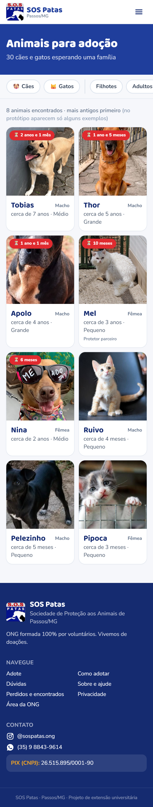

**Objetivo:** listar os animais disponíveis com filtros.

- **Filtros (chips):** Cães/Gatos · Filhotes/Adultos (RN11) · Mini/Pequeno/Médio/Grande/Gigante · "Convive com outros animais". Um chip por grupo; tocar de novo desliga o filtro.
- **Ordem:** mais antigos primeiro (RN10).
- **Grade:** 2 colunas no celular, 3 no tablet e 4 no computador.
- **Sem resultado:** mensagem + "Limpar filtros".
- **Cards:** usam **só a miniatura** (RN03).

### T03 · Ficha do animal · `/animais/:id` · ⏳
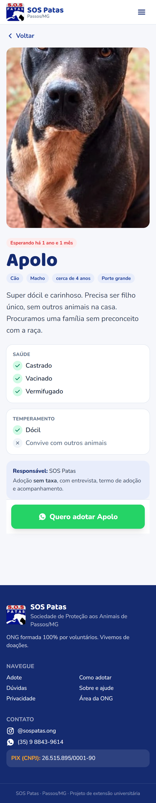

**Objetivo:** dar todas as informações para a decisão e levar ao WhatsApp.

- **Galeria:** foto completa grande + miniaturas, se houver mais de uma (até 3, RN01).
- **Tags:** espécie, sexo, idade aproximada (RN13), porte (mini a gigante).
- **Linha de detalhes:** raça (pura/mestiço) e cor da pelagem.
- **Bloco Saúde:** castrado ("Castrado" ou "Ainda não castrado", sem promessa de castração, RN17); vacinado, com as vacinas entre parênteses; vermifugado nos últimos 3 meses ("sem informação" aparece em cinza); problema de saúde em amarelo, ou "Sem problema de saúde conhecido".
- **Bloco Temperamento:** dócil, convive com outros animais ("não informado" quando nulo).
- **Responsável:** nome e indicação de protetor parceiro + "Adoção com formulário de interesse, termo de adoção e 15 dias de adaptação". Se for protetor, mostra um aviso amarelo de que a ONG não é responsável pela adoção (RN31).
- **Benefício (verde):** "Adotando pelo site: prioridade na castração gratuita (castramóvel) e desconto em clínicas parceiras" (RN32).
- **Botão "Quero adotar {nome}":** verde, **fixo no rodapé no celular**, e abre o **formulário de adoção** (T26, RN14). ✏️ _Protótipo a atualizar: hoje abre um modal explicando._
- **Animal em análise (RN48), por link direto:** sem o botão; aviso "{nome} está em processo de adoção" e botão "Ver outros animais" _(proposta)_.

### T26 · Formulário de adoção · `/animais/:id/adotar` · 🆕 a desenhar no protótipo
**Objetivo:** quem quer adotar responder às perguntas da triagem e conhecer o termo antes de pedir (RN14, RN15, RN47).

- **Topo:** o animal escolhido (miniatura, nome, responsável), preenchido automaticamente.
- **Perguntas em blocos**, uma tela com rolagem ou passos (Sobre você · Sua casa · Outros animais · Cuidados e custos), com as perguntas da [versão 1.1 do formulário](../docs/formulario/FORMULARIO_ADOCAO.md). Perguntas condicionais aparecem só quando se aplicam (proprietário permite animais, tela nas janelas para gatos, perguntas 16–18).
- **Termo de adoção:** bloco "Antes de enviar, leia o termo" com as cláusulas do [termo](../docs/formulario/TERMO_ADOCAO.md) (abre e fecha) e o aviso de que ele é assinado em papel na entrega; caixa obrigatória **"Li o termo de adoção e estou ciente dos compromissos"** (RN47).
- **Compromissos** (declarações da pergunta 25) e **consentimento LGPD**, todos obrigatórios; Turnstile; botão "Enviar pedido".
- **Erros:** mensagem embaixo de cada campo; se outra pessoa acabou de pedir o animal (RN48), aviso e botão "Ver outros animais".

**T26b · Pedido enviado:** "Recebemos seu pedido para adotar {nome}!", próximos passos (a equipe analisa e fala com você pelo WhatsApp; o termo é assinado na entrega; 15 dias de adaptação) e link para a vitrine.

### T04 · Como adotar · `/como-adotar` · ✅
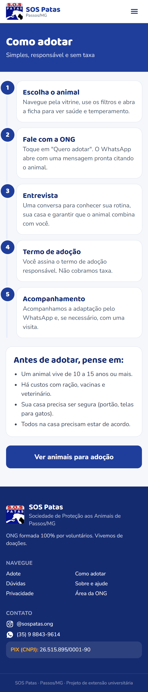

- **Linha do tempo com 5 passos:** escolher → **preencher o formulário de interesse** → análise pela equipe ou protetor, com contato pelo WhatsApp → termo de responsabilidade → **período de adaptação de 15 dias** (se não se adaptar, devolver a quem doou; nunca repassar nem abandonar).
- **Card verde "Vantagem de adotar pelo site":** prioridade no castramóvel e desconto em clínicas parceiras (a ONG confere na lista de adoções).
- **Card amarelo "Animais de protetores parceiros":** a adoção é combinada com o protetor e a ONG não é responsável.
- **Validado pela ONG em 06/10/2026** (prazo de adaptação, devolução, responsabilidade do protetor e benefício da castração).
- **"Antes de adotar, pense em":** tempo de vida, custos, casa segura, família de acordo.
- **Botão:** "Ver animais para adoção".
- **Editável em T18:** subtítulo, passos, "antes de adotar", vantagens e o aviso de protetores. Títulos de seção e botão ficam fixos.
- **Clínicas parceiras:** o site **não cita nomes nem valores de desconto**, só que existem parcerias com clínicas veterinárias (pedido da ONG, RN32).

### T05 · Perguntas frequentes · `/perguntas-frequentes` · ⏳
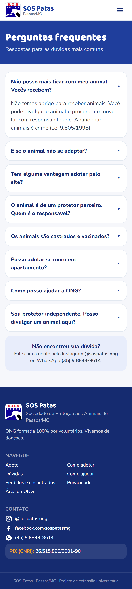

**Formato:** acordeão (toque para abrir). Perguntas baseadas no que a Gracia contou e no post "Como funciona a ONG SOS Patas":
1. Não posso ficar com meu animal, vocês recebem? Não têm abrigo; abandono é crime.
2. E se o animal não se adaptar? 15 dias de adaptação; devolver a quem doou.
3. Tem vantagem adotar pelo site? Prioridade no castramóvel e desconto em clínicas parceiras.
4. Animal de protetor parceiro: quem é o responsável? O próprio protetor.
5. Os animais são castrados e vacinados? Ver a ficha; filhotes podem ainda não ter idade para castrar.
6. Posso adotar morando em apartamento? Depende do animal.
7. Como posso ajudar? PIX, lar temporário, compartilhar.
8. Sou protetor, posso divulgar aqui? Falar com a ONG.

**Removidas em 07/10/2026:**
- ~~"Vocês resgatam animais?"~~ e ~~"Vocês buscam o animal em casa?"~~: o site não fala sobre resgates (RN44).
- ~~"A adoção tem taxa?"~~: o site não fala de taxa (RN45).

**Textos a validar com a Gracia** (principalmente as respostas 3, 6 e 8).

**Editável em T16:** as perguntas e respostas vêm de `conteudo_itens` (`lista = perguntas`), na ordem definida pela equipe. O bloco "Não encontrou sua dúvida?" fica fixo e usa o Instagram e o WhatsApp da tabela `ong`.

### T06 · Como ajudar · `/ajude` · ✏️ reformulada em 07/10
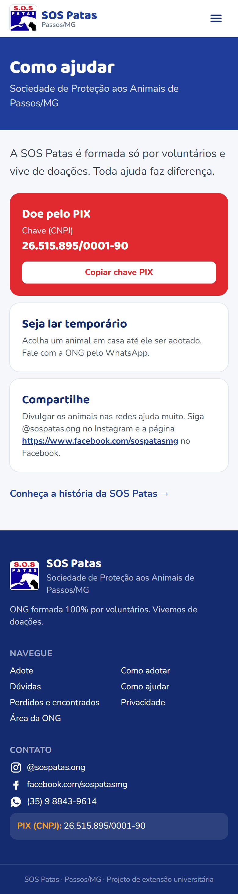

Antiga "Sobre e ajude" (`/sobre` redireciona para cá). A missão e o "Como funcionamos" foram para o Início (T01).
- **Introdução** ✎ (`ajude.introducao`), opcional.
- **Card vermelho do PIX:** tipo e chave da tabela `ong`, botão "Copiar chave PIX". Fixo, não é item de lista.
- **Formas de ajudar** ✎ (`ajude_formas`): "Seja lar temporário", "Compartilhe"… (título + texto).
- **Menu do site:** o item "Sobre e ajude" passa a se chamar **"Como ajudar"**.

### T07 · Privacidade · `/privacidade` · ⏳
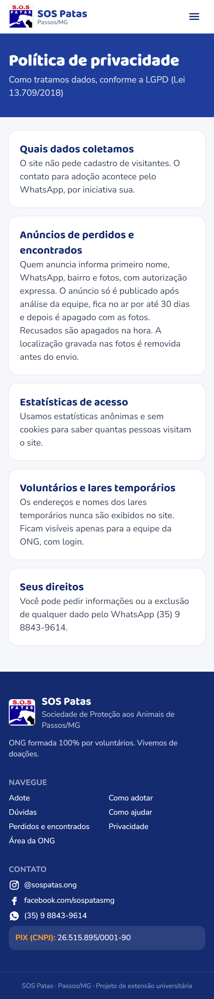

Texto curto sobre LGPD: o site não cadastra visitantes, as estatísticas são anônimas, os lares temporários nunca aparecem e há canal para pedir a exclusão de dados.

✏️ _A atualizar (08/10/2026), no protótipo e no site:_ trocar "O contato para adoção acontece pelo WhatsApp, por iniciativa sua" por uma seção **"Pedidos de adoção"**: o formulário guarda nome, WhatsApp, bairro e cidade e as respostas; só a equipe vê; o pedido recusado ou não concluído é apagado em 90 dias; o endereço completo e os documentos ficam só no termo em papel (RN15).

### T12 · Perdidos e encontrados · `/perdidos` · ⏳
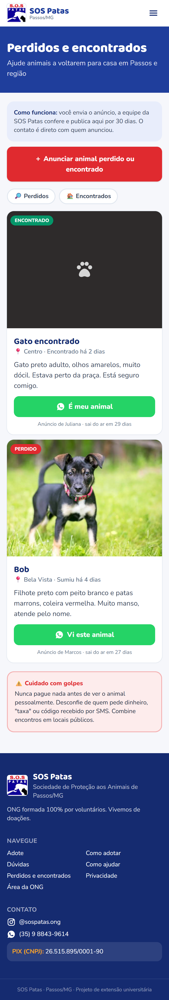

**Objetivo:** ajudar a comunidade a reencontrar animais. Só aparecem anúncios **aprovados** pela equipe (RN18).

- **"Como funciona"** + botão vermelho "＋ Anunciar animal perdido ou encontrado".
- **Filtro:** Perdidos / Encontrados.
- **Card:** foto, selo PERDIDO (vermelho) ou ENCONTRADO (verde), nome ou "Cachorro/Gato encontrado", bairro, há quanto tempo, descrição, botão WhatsApp ("Vi este animal" / "É meu animal") com mensagem pronta, dias até sair do ar (RN25).
- **Aviso fixo contra golpes** (RN28).
- **Atalho na página inicial:** card "Perdeu ou encontrou um animal?".

### T13 · Anunciar animal · `/perdidos/novo` · ⏳
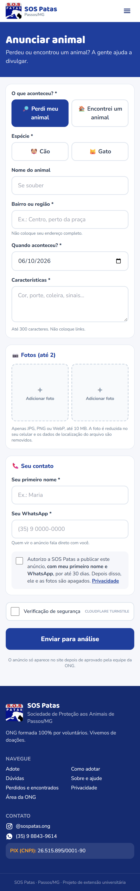

**Formulário público, com segurança em camadas (RN19–RN23):**
1. **O que aconteceu:** perdi / encontrei; espécie; nome (opcional); **bairro ou região** (com aviso "não coloque o endereço completo"); data; características (até 300, sem links).
2. **Fotos:** até 2; JPG, PNG ou WebP de até 10 MB na escolha; redesenhadas no celular como WebP sem localização (RN20).
3. **Contato:** primeiro nome + WhatsApp; **checkbox obrigatório de consentimento** para publicar por 30 dias.
4. **Verificação de segurança** (Cloudflare Turnstile).
5. **Botão "Enviar para análise":** deixa claro que o anúncio não é publicado na hora.

**T13b · Confirmação** ([print](telas/T13b-anuncio-enviado-celular.png)): "Recebemos seu anúncio!", prazo de até 1 dia, dicas para divulgar e aviso contra golpes.

---

## Área da ONG (login obrigatório)

### Navegação
Tudo que muda no site é alterado por aqui, pelo celular (DESENVOLVIMENTO.md, seção 4).

```
┌───────────────────────────────────┐
│ ▓ Área da ONG         Olá, Gracia │  ← CabecalhoAdmin
│                                   │
│          (conteúdo da aba)        │
│                                   │
├───────┬───────┬───────┬──────┬────┤
│  🐾   │ 📋 ②  │ 🔎 ③  │  📝  │ ☰  │  ← BarraAdmin (fixa)
│Animais│Pedidos│Perdid.│Textos│Mais│
└───────┴───────┴───────┴──────┴────┘
```

| Aba | Tela inicial | Leva a |
|---|---|---|
| 🐾 Animais | T09 | T10, T11 |
| 📋 Pedidos | T27 (número vermelho = pedidos aguardando análise) | T28 |
| 🔎 Perdidos | T14 (número vermelho = anúncios aguardando) | T21 |
| 📝 Textos | T15 | T16–T20, T17 |
| ☰ Mais | T22 | T23, T24, "Ver o site", "Sair" |

**Padrões de todas as telas de edição:** barra fixa "Cancelar / Salvar"; depois de salvar, toast **"Salvo e publicado ✓"** com link "Ver no site" (RN37); linha `AlteradoPor` (RN43); toda exclusão abre modal de confirmação (RN36).

### T08 · Login · tela do Cloudflare Access ao abrir `/admin` · ✏️ alterada em 07/10
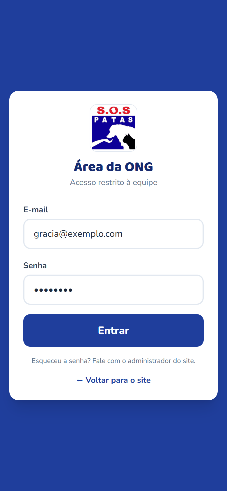

**Sem senha** ([ARQUITETURA.md](../docs/ARQUITETURA.md), seção 4):
1. **E-mail** → botão **"Enviar código"**.
2. A pessoa recebe um **código de 6 dígitos** no e-mail → digita → **"Entrar"**.
3. Fica conectada por **30 dias** naquele celular.

- Só e-mails liberados pela ONG entram. Sem "criar conta".
- Rodapé: "Não recebeu? Confira o spam ou peça um novo código. Para liberar um e-mail novo, fale com o administrador do site."
- **No site real**, essa tela é a página de login do Cloudflare Access, personalizada com a logo e as cores da SOS Patas. O protótipo simula as duas etapas (`#/admin/login` e `#/admin/login/codigo`, [print da etapa 2](telas/T08b-login-codigo-celular.png)).

### T09 · Painel de animais · `/admin` · ⏳
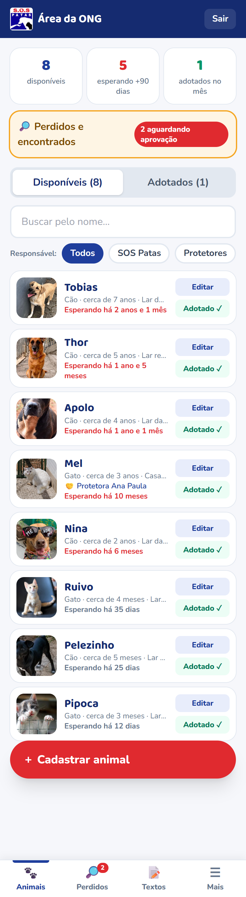

**Objetivo:** Gracia e Claudia controlarem tudo pelo celular.

- **Números:** disponíveis · adultos esperando há mais de 90 dias · **adotados no mês** (indicador da avaliação).
- **Abas:** Disponíveis / Em análise / Adotados (RN48). ✏️ _Protótipo a atualizar._
- **Busca** pelo nome.
- **Item da lista:** miniatura, nome, espécie, idade, **lar temporário** (privado), tempo de espera (vermelho se adulto há mais de 90 dias); botões **Editar** e **Adotado ✓**.
- **Aba Adotados:** "Em adaptação: faltam N dias" ou "Adoção concluída" (RN30).
- **Filtro por responsável** (abaixo da busca): "Todos · SOS Patas · Protetores", e ao tocar em "Protetores" aparece a lista para escolher um. O nome do protetor aparece no item da lista.
- **Card amarelo de perdidos:** só aparece quando há anúncios aguardando aprovação (o número também fica na aba 🔎).
- **Botão flutuante:** "＋ Cadastrar animal", acima da `BarraAdmin`.

### T27 · Pedidos de adoção · `/admin/pedidos` · 🆕 a desenhar no protótipo
**Objetivo:** a equipe saber quem pediu qual animal e analisar logo, porque o animal fica fora do site enquanto isso (RN48, RN49).

- **Abas:** Pendentes (padrão) / Aprovados / Recusados.
- **Item:** miniatura e nome do animal, nome de quem pediu, bairro, "há N dias", número de alertas (amarelo); **vermelho se pendente há mais de 3 dias** (RN50, prazo a confirmar).
- Animal de protetor parceiro: selo "Protetor: {nome}".

### T28 · Análise do pedido · `/admin/pedidos/:id` · 🆕 a desenhar no protótipo
- **Topo:** animal (com link para T11), quem pediu, WhatsApp com botão para conversar, data do pedido.
- **Alertas automáticos** em amarelo no topo (tabela do FORMULARIO_ADOCAO.md), sem reprovar sozinhos.
- **Respostas** agrupadas pelos blocos do formulário; "Ciente do termo em {data}".
- **Observação interna** (só a equipe vê).
- **Ações:** **Aprovar** (o animal continua fora do site até "Marcar como adotado", que já vem com nome e WhatsApp preenchidos) e **Recusar** (modal: "O animal volta para o site. Avise a pessoa pelo WhatsApp."). Linha `AlteradoPor` (RN43).

### T10 · Cadastrar animal · `/admin/animais/novo` · ⏳
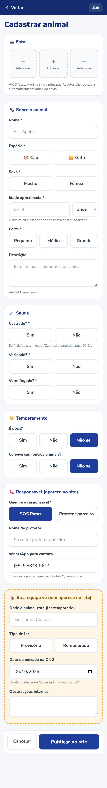

Formulário em uma tela, dividido em blocos, com escolhas em **botões grandes**:
1. **Fotos:** 3 espaços; a primeira é a principal; compressão automática (RN02).
2. **Sobre o animal:** nome*, espécie*, sexo*, idade aproximada* (número + anos/meses, convertido em `nascimento_aprox`), porte* (mini, pequeno, médio, grande, gigante), raça + pura/mestiço, cor da pelagem, descrição (até 500).
3. **Saúde:** castrado* (Sim/Não); vacinado* (Sim/Não/Sem informação) + quais vacinas; vermifugado nos últimos 3 meses* (Sim/Não/Sem informação); problema de saúde (Não/Sim + qual). **Mesmos campos do termo de adoção.**
4. **Temperamento:** dócil, convive com outros animais (Sim/Não/Não sei).
5. **Responsável:** SOS Patas ou protetor parceiro. Se protetor, escolhe na lista de `protetores` ou toca em **"＋ Novo protetor"** (nome e WhatsApp, em um modal) (RN42). Se SOS Patas, usa o WhatsApp da tabela `ong`.
6. **Bloco amarelo "Só a equipe vê":** lar temporário, tipo de lar (provisório/remunerado), data de entrada (padrão hoje), observações internas → tabela `animais_privado`.
7. **Barra fixa:** "Cancelar" e **"Publicar no site"**.

### T11 · Editar animal · `/admin/animais/:id` · ⏳
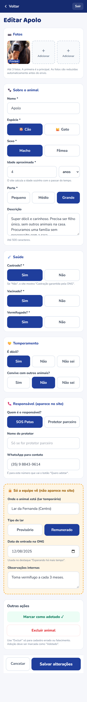

Igual a T10, preenchido, com a linha "Alterado por… em…" (RN43) no topo e **"Outras ações"**:
- **Ver no site ↗:** abre a ficha pública em nova aba (só se disponível).
- **Marcar como adotado:** modal pede o **nome e o WhatsApp de quem adotou** (privados) → status `adotado`, `data_adocao` = hoje, mantém só a foto principal (RN07, RN08) → mostra a confirmação com a data de fim da adaptação (RN30).
- **Voltar para disponível** (aparece se o animal estiver adotado).
- **Excluir animal:** modal vermelho avisando que apaga o cadastro e **todas as fotos** (RN05, RN09), sugerindo "Marcar como adotado" quando for o caso.

### T14 · Moderar perdidos e encontrados · `/admin/perdidos` · ⏳
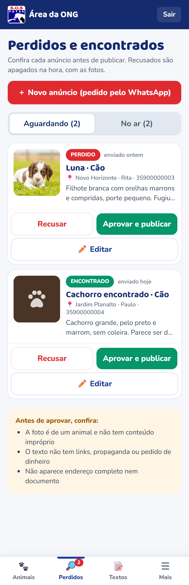

- **Acesso:** pelo card amarelo no painel (T09), que mostra quantos anúncios estão aguardando aprovação.
- **Abas:** Aguardando / No ar.
- **Aguardando:** foto (da quarentena privada, servida pela API só para a equipe), tipo, nome, bairro, contato e descrição; botões **Recusar** (apaga tudo, RN26) e **Aprovar e publicar** (copia as fotos para o bucket público).
- **No ar:** "Sai do ar em N dias", **"Renovar por mais 30 dias"** (RN41), **"Voltou para casa 🎉"** e **"Tirar do ar"** (esses dois apagam o anúncio e as fotos).
- **Em todos os cards:** botão **"Editar"** → T21 (RN40). Anúncios criados pela equipe têm o selo "Criado pela equipe".
- **Botão "＋ Novo anúncio"** no topo → T21 (RN39).
- **Checklist de moderação:** é um animal, sem conteúdo impróprio, sem link, sem pedido de dinheiro e sem endereço completo.

### T21 · Anúncio pela equipe · `/admin/perdidos/novo` e `/admin/perdidos/:id` · ⏳
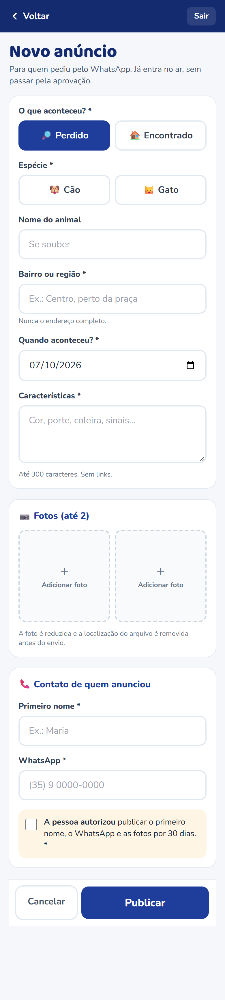

**Objetivo:** publicar o anúncio de quem pediu pelo WhatsApp e corrigir anúncios recebidos.

- **Mesmos campos da T13** (perdi/encontrei, espécie, nome, bairro, data, características, até 2 fotos, primeiro nome e WhatsApp do contato), com os mesmos limites. Sem Turnstile.
- **Novo:** checkbox obrigatório **"A pessoa autorizou publicar o primeiro nome, o WhatsApp e as fotos por 30 dias"**. Botão **"Publicar"**: entra direto no ar (RN39).
- **Editar:** formulário preenchido, com o status ("Aguardando aprovação" ou "No ar, sai em N dias"); fotos com ✕ para remover e espaço para adicionar (RN40); botão **"Salvar alterações"**. Se o anúncio estiver pendente, aparecem também "Recusar" e "Aprovar e publicar".
- **Aviso:** "Quem anunciou não é avisado das alterações."

### T15 · Textos do site · `/admin/textos` · ⏳
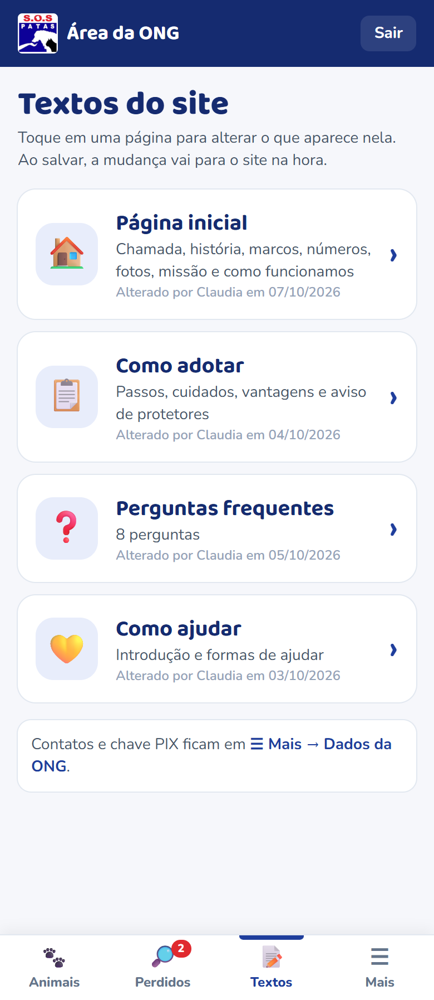

**Objetivo:** ponto de entrada para alterar o conteúdo das páginas públicas.

Lista de cards grandes, um por página, com ícone, nome, o que dá para mudar e "Alterado em…":
| Card | Vai para | Resumo |
|---|---|---|
| 🏠 Página inicial | T19 | Chamada, história, marcos, números, fotos, missão e como funcionamos |
| 📋 Como adotar | T18 | Passos, cuidados, vantagens, aviso de protetores |
| ❓ Perguntas frequentes | T16 | N perguntas |
| 💛 Como ajudar | T20 | Introdução e formas de ajudar |

Abaixo, uma nota: "Contatos e PIX ficam em ☰ Mais → Dados da ONG."

### T16 · Perguntas frequentes · `/admin/textos/perguntas` · ⏳
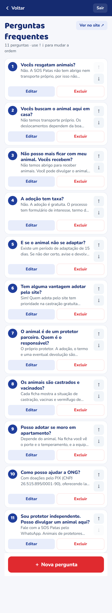

**Objetivo:** adicionar, alterar, reordenar e excluir perguntas.

- **Cabeçalho:** "Perguntas frequentes · 8 perguntas" + "Ver no site ↗".
- **`ListaEditavel`:** cada card mostra o número, a pergunta em negrito e as 2 primeiras linhas da resposta; à direita, ↑ ↓; embaixo, **Editar** e **Excluir** (RN35, RN36). O ↑ do primeiro e o ↓ do último ficam desativados.
- **Excluir:** modal "Excluir a pergunta '…'? Ela some do site e não pode ser recuperada." [Cancelar] [Excluir]. Com só 1 pergunta, o Excluir fica desativado.
- **Botão "＋ Nova pergunta"** (fixo embaixo) → T17.
- Sem categorias e sem "ocultar" (decisão de 07/10).

### T17 · Item de lista (novo / editar) · `/admin/textos/:lista/novo` e `/admin/textos/:lista/:id` · ⏳
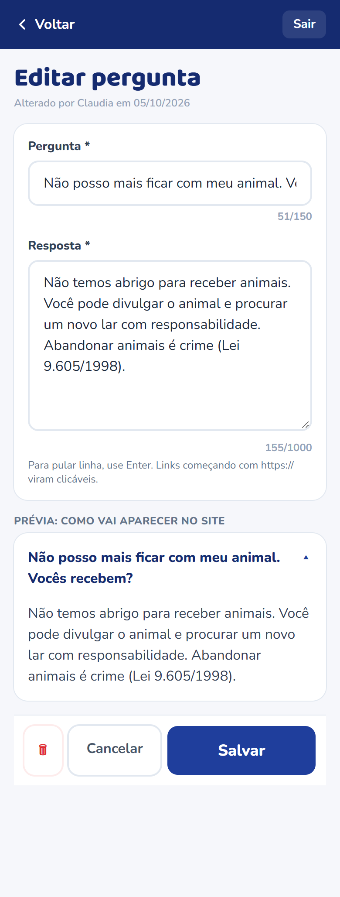

**Objetivo:** um único formulário para qualquer item de lista, com rótulos conforme a lista (DESENVOLVIMENTO.md, `conteudo_itens`).

| Lista | Título da tela | Campo 1 | Campo 2 |
|---|---|---|---|
| `perguntas` | Nova pergunta | Pergunta (150) | Resposta (1000) |
| `como_adotar_passos` | Novo passo | Título do passo (60) | Explicação (600) |
| `como_adotar_antes` | Novo cuidado | – | Texto (200) |
| `como_adotar_vantagens` | Nova vantagem | Destaque (60, opcional) | Texto (200) |
| `inicio_marcos` | Novo marco da história | Ano ou data (20) | O que aconteceu (300) |
| `inicio_numeros` | Novo número | Número (20) | O que significa (80) |
| `inicio_fotos` | Nova foto | **Foto*** (escolher/trocar) | Legenda (120) |
| `inicio_como_funcionamos` | Novo item | Título (40) | Texto (150) |
| `ajude_formas` | Nova forma de ajudar | Título (40) | Texto (300) |

- **Lista `inicio_fotos`** ([print](telas/T17b-editar-foto-historia-celular.png)): foto grande com botão "Trocar foto", legenda e o lembrete "Fotos com pessoas: só com autorização delas; crianças e adolescentes, só com autorização dos responsáveis" (RN38).
- **Listas com máximo** (`inicio_numeros`: 4, `inicio_fotos`: 8): ao atingir o limite, o "＋ Adicionar" vira o aviso "Limite atingido. Exclua um item para adicionar outro."

- Contador de caracteres em cada campo; o campo longo cresce conforme o texto.
- **Dica abaixo do texto:** "Para pular linha, use Enter. Links começando com https:// viram clicáveis." (RN34)
- **Prévia** logo abaixo, com o visual do site (ex.: o acordeão da pergunta aberto).
- Barra fixa: "Cancelar" e "Salvar". Ao editar, também "Excluir" (com o modal da RN36).

### T18 · Editar Como adotar · `/admin/textos/como-adotar` · ⏳
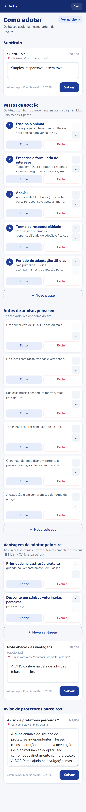

Uma tela com blocos na ordem em que aparecem no site:
1. **Subtítulo** (`CampoTextoEditavel`, 100).
2. **Passos da adoção** (`ListaEditavel`, mínimo 1): número, título e começo da explicação.
3. **Antes de adotar, pense em** (`ListaEditavel`).
4. **Vantagem de adotar pelo site** (`ListaEditavel`) + nota de rodapé (`CampoTextoEditavel`, 200) + aviso "Sem citar clínicas nem valores: só que existem parcerias."
5. **Aviso de protetores parceiros** (`CampoTextoEditavel`, 500).

Cada campo de texto tem o próprio botão "Salvar"; listas salvam item a item (T17).

### T19 · Editar Página inicial · `/admin/textos/inicio` · ⏳
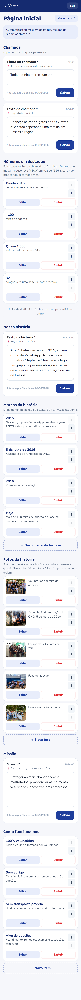

1. **Chamada:** título (60) e texto (200).
2. **Números em destaque** (`ListaEditavel` de `inicio_numeros`, até 4), com a dica "Use números que mudam pouco (ex.: '+100' em vez de '116'), para não precisar atualizar todo mês" (RN46).
3. **Nossa história:** texto (2000).
4. **Marcos da história** (`ListaEditavel` de `inicio_marcos`, ordenados pela equipe).
5. **Fotos da história** (`ListaEditavel` de `inicio_fotos`, até 8, com miniatura em cada item): a primeira abre a história; as demais formam a galeria (RN38).
6. **Missão** (400).
7. **Como funcionamos** (`ListaEditavel`).
8. **Esperando há mais tempo:** só o texto (200); os animais entram automaticamente.
- Nota fixa no topo: "Automáticos: animais em destaque, resumo de 'Como adotar' e PIX."

### T20 · Editar Como ajudar · `/admin/textos/ajude` · ⏳
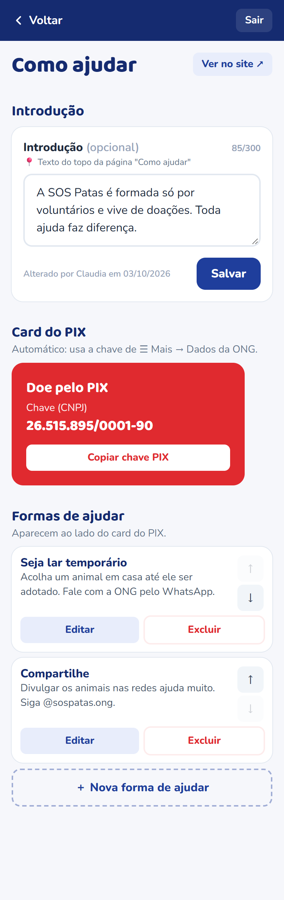

1. **Introdução** (300, opcional).
2. **Formas de ajudar** (`ListaEditavel` de `ajude_formas`).
- Nota: "O card do PIX usa a chave de ☰ Mais → Dados da ONG."

### T22 · Mais · `/admin/mais` · ⏳
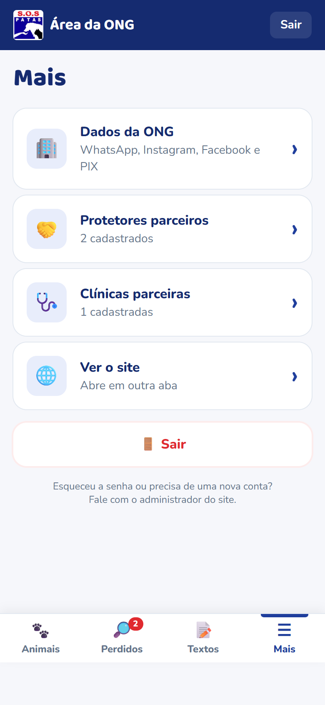

Lista simples, com botões grandes:
- 🏢 **Dados da ONG** → T23
- 🤝 **Protetores parceiros** (N) → T24
- 🌐 **Ver o site** ↗
- 🚪 **Sair**
- Rodapé: "Precisa liberar o acesso de outra pessoa? Fale com o administrador do site."

### T23 · Dados da ONG · `/admin/ong` · ⏳
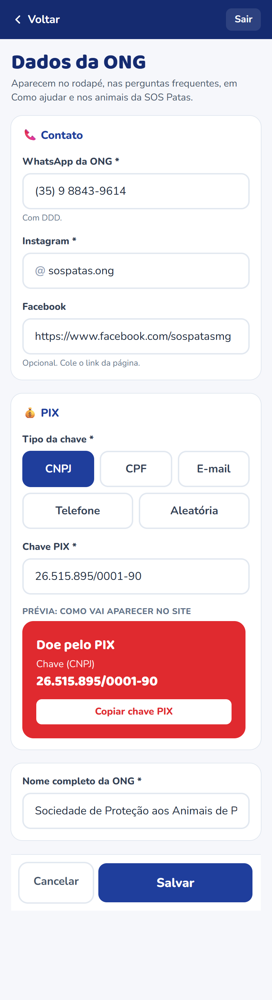

Formulário com os dados da tabela `ong`:
- **WhatsApp da ONG*** (com máscara `(35) 9 9999-9999`; salvo só com dígitos). Ajuda: "Usado no rodapé, nas perguntas frequentes e nos animais da SOS Patas."
- **Instagram*** (com `@` fixo à esquerda) e **Facebook** (link, opcional).
- **PIX:** tipo da chave (botões: CNPJ, CPF, E-mail, Telefone, Aleatória) e chave*.
- **Prévia** do card do PIX como aparece no site.
- Nome completo da ONG (pouco usado, no fim).
- Barra fixa "Cancelar / Salvar"; `AlteradoPor`.

### T24 · Protetores parceiros · `/admin/protetores` · ⏳
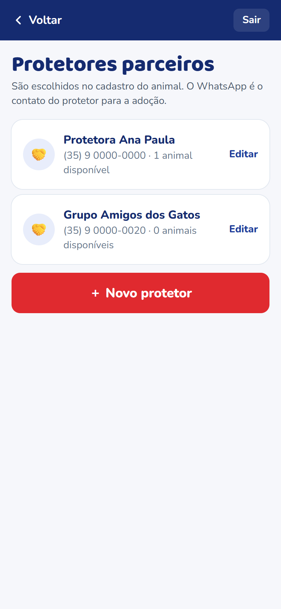

- Lista: nome, WhatsApp formatado e "N animais disponíveis".
- Tocar em um protetor abre um modal com nome e WhatsApp: **Salvar** e **Excluir**. Se o protetor tiver animais, o excluir mostra o aviso da RN42 com o link "Ver animais dele" (T09 filtrado).
- Botão "＋ Novo protetor".

~~T25 · Clínicas parceiras~~: **removida em 07/10/2026**. A ONG não quer citar clínicas nem valores (RN32).

---

## Perguntas para a validação com a ONG

Enviar os prints de [telas/](telas/) à Gracia e perguntar:

1. As cores e o visual combinam com a SOS Patas? ~~Vocês têm o logo em boa qualidade?~~ **Respondido:** logo recebida em 06/10.
2. A ficha do animal tem tudo o que vocês querem mostrar? Falta algum campo?
3. ~~"Castração garantida pela ONG"~~: **respondido**, não usar (RN17).
3.1. **Formulário de interesse em adoção:** quais perguntas? (em definição no grupo)
4. Os textos das **perguntas frequentes** estão corretos? Querem mudar ou acrescentar alguma?
5. O WhatsApp de contato padrão é o **(35) 9 8843-9614**?
6. Podemos mostrar a **chave PIX** no site?
7. O formulário de cadastro está fácil de entender no celular?
8. O botão do WhatsApp na ficha deve ir para o número da ONG ou do responsável pelo animal?
9. **Perdidos e encontrados:** vocês topam aprovar os anúncios? Quem faria isso, e conseguem olhar pelo menos uma vez por dia?
10. 30 dias no ar é um bom prazo para os anúncios de perdidos?
11. ~~História da ONG~~: **respondido em 07/10** (texto, marcos, números e 5 fotos; PROJETO.md, Entrevista 3).
12. ~~Clínicas parceiras~~: **respondido em 07/10**, não citar clínicas nem valores (RN32).
15. ~~Resgates~~: **respondido em 07/10**. O site não fala se a ONG faz ou não resgates; aviso e perguntas sobre isso removidos (RN44).
16. **Legendas das fotos:** confirmar as legendas das fotos, exceto a da assembleia (equipe em 2016 e feiras de adoção). Onde e quando foram as feiras?
17. **Autorização de imagem:** as pessoas que aparecem nas fotos autorizam a publicação no site? Em algumas aparecem crianças e adolescentes: os responsáveis autorizam? (RN38)
18. **Nomes na história:** tudo bem citar Stephanie Christiene, pastora Dalva, Gracia, Tarlei, Deide e Adriana? E o caso do cão preso no arame: está bem contado assim?
19. **Foto da assembleia de fundação:** alguém tem essa foto em melhor qualidade (o arquivo original da câmera ou celular, sem passar pelo WhatsApp, que reduz a imagem) ou outra foto do mesmo dia?
13. **Área da ONG:** além de Gracia e Claudia, alguém mais vai ter acesso? A navegação com a barra de baixo (Animais · Perdidos · Textos · Mais) ficou fácil?
14. Vocês recebem pedidos de "perdido/encontrado" pelo WhatsApp que gostariam de publicar por conta própria? (T21)
20. **Pedidos de adoção (08/10/2026):** o animal sai do site enquanto o pedido está em análise. Em quantos dias vocês conseguem analisar um pedido? (proposta: avisar no painel depois de 3 dias)
21. Nos animais de **protetores parceiros**, quem analisa o pedido: a equipe (e repassa pelo WhatsApp) ou o próprio protetor?
22. Quem abrir a ficha de um animal em análise por um link antigo: mostrar um aviso "em processo de adoção" (proposta) ou a página "não encontrado"?

### Registro da validação
| Data | Quem validou | Telas | Retorno | Ajustes |
|---|---|---|---|---|
| | | | | |
