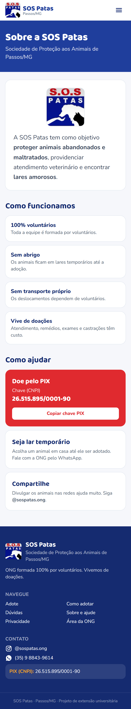

# Especificação das Telas: Site SOS Patas

> Protótipo navegável: [index.html](index.html) (abrir no navegador; botão **"☰ Telas do protótipo"** no canto inferior esquerdo).
> Prints de cada tela (celular e computador): [telas/](telas/). Para gerar de novo: `python prototipo/gerar_prints.py`.
> Regras de negócio (RN) e modelo de dados: [../DESENVOLVIMENTO.md](../DESENVOLVIMENTO.md).
>
> **Ao desenvolver em React, cada tela abaixo vira uma página. Reaproveitar as classes Tailwind e os tokens de design do protótipo.**

**Status de validação:** ⏳ aguardando a ONG · ✅ validada · ✏️ ajustar

---

## Identidade visual

Baseada no logo e nos posts do Instagram @sospatas.ong.

| Token | Cor | Uso |
|---|---|---|
| `azul` | `#1F3E9C` | Cor principal: cabeçalhos, botões principais, títulos |
| `azul-escuro` | `#152B70` | Textos de título, rodapé, cabeçalho da área da ONG |
| `azul-claro` | `#E8EDFB` | Fundos de destaque e tags |
| `vermelho` | `#E02A2F` | Urgência: "Esperando há mais tempo", doação, excluir |
| `amarelo` | `#F5A623` | Botão principal da página inicial, avisos |
| `fundo` | `#F6F7FB` | Fundo das páginas |
| WhatsApp | `#25D366` | Somente no botão "Quero adotar" |

- **Fontes:** *Baloo 2* para títulos (arredondada, lembra os cartazes da ONG) e *Nunito* para textos (Google Fonts).
- **Logo:** [assets/logo.png](assets/logo.png), recortado do post do Instagram. **Pedir à ONG o arquivo original em boa resolução.**
- **Cantos arredondados** (`rounded-2xl` nos cards, `rounded-xl` nos botões); botões com pelo menos 44 px de altura.

## Componentes reutilizáveis

| Componente | Onde aparece | Observação |
|---|---|---|
| `Cabecalho` | Todas as páginas públicas | Logo + menu; no celular vira menu sanduíche |
| `Rodape` | Todas as páginas públicas | Contatos, PIX e link "Área da ONG" |
| `CardAnimal` | T01, T02 | Miniatura, nome, sexo, idade, porte; selo vermelho "⏳ tempo de espera" para adultos há mais de 90 dias (RN12) |
| `FotoAnimal` | Cards, ficha, painel | Sem foto: fundo colorido com pata |
| `Tag` | Ficha | Pílula colorida (espécie, sexo, idade, porte) |
| `ChipFiltro` | T02 | Liga/desliga; rolagem horizontal no celular |
| `BlocoPix` | T01, T06, rodapé | Chave CNPJ + botão "Copiar chave PIX" |
| `Modal` | Quero adotar, adotado, excluir | Confirmações sempre com "Cancelar" |
| `OpcoesBotao` | Formulário | Escolha em botões grandes (melhor que select no celular) |
| `CabecalhoAdmin` | T09–T11 | Fundo azul-escuro, para diferenciar do site público |

---

## Site público

### T01 · Início · `/` · ⏳

**Objetivo:** apresentar a ONG e levar a pessoa à vitrine, com destaque para os adultos.

**Seções, na ordem:**
1. **Hero:** selo "Adoção responsável · sem taxa", título "Toda patinha merece um lar.", botões "Ver animais para adoção" e "Ajude a ONG", fotos de dois animais.
2. **Números:** animais esperando, adultos, "100% voluntários".
3. **Esperando há mais tempo:** até 6 adultos há mais de 90 dias (RN12).
4. **Como adotar:** 4 passos resumidos.
5. **Aviso amarelo:** "A SOS Patas não faz resgates" (reduz as mensagens de resgate).
6. **Doação:** "A ONG vive de doações" + PIX.

**Dados:** `animais` com status `disponivel`.

### T02 · Vitrine · `/animais` · ⏳

**Objetivo:** listar os animais disponíveis com filtros.

- **Filtros (chips):** Cães/Gatos · Filhotes/Adultos (RN11) · Pequeno/Médio/Grande · "Convive com outros animais". Tocar de novo desliga o filtro.
- **Ordem:** mais antigos primeiro (RN10).
- **Grade:** 2 colunas no celular, 3 no tablet e 4 no computador.
- **Sem resultado:** mensagem + "Limpar filtros".
- **Cards:** usam **só a miniatura** (RN03).

### T03 · Ficha do animal · `/animais/:id` · ⏳

**Objetivo:** dar todas as informações para a decisão e levar ao WhatsApp.

- **Galeria:** foto completa grande + miniaturas, se houver mais de uma (até 3, RN01).
- **Tags:** espécie, sexo, idade aproximada (RN13), porte.
- **Bloco Saúde:** castrado (se não: **"Castração garantida pela ONG"**, RN17), vacinado, vermifugado.
- **Bloco Temperamento:** dócil, convive com outros animais ("não informado" quando nulo).
- **Responsável:** nome e indicação de protetor parceiro + "Adoção sem taxa".
- **Botão "Quero adotar {nome}":** verde, **fixo no rodapé no celular**, e abre o WhatsApp do responsável com a mensagem pronta (RN14). No protótipo, abre um modal explicando.

### T04 · Como adotar · `/como-adotar` · ⏳

- **Linha do tempo com 5 passos:** escolher → falar com a ONG → entrevista → termo de adoção (sem taxa) → acompanhamento.
- **"Antes de adotar, pense em":** tempo de vida, custos, casa segura, família de acordo.
- **Botão:** "Ver animais para adoção".

### T05 · Perguntas frequentes · `/perguntas-frequentes` · ⏳

**Formato:** acordeão (toque para abrir). Perguntas baseadas no que a Gracia contou e no post "Como funciona a ONG SOS Patas":
1. Vocês resgatam animais? **Não.** Não têm abrigo nem transporte; equipe 100% voluntária.
2. Vocês buscam o animal em casa? Não têm transporte próprio.
3. Não posso ficar com meu animal, vocês recebem? Não têm abrigo; abandono é crime.
4. A adoção tem taxa? **Não.**
5. Os animais são castrados e vacinados? Ver a ficha; castração garantida para filhotes.
6. Posso adotar morando em apartamento? Depende do animal.
7. Como posso ajudar? PIX, lar temporário, compartilhar.
8. Sou protetor, posso divulgar aqui? Falar com a ONG.

**Textos a validar com a Gracia** (principalmente as respostas 3, 6 e 8).

### T06 · Sobre e ajude · `/sobre` · ⏳

- **Missão (texto do Facebook da ONG):** "proteger animais abandonados e maltratados, providenciar atendimento veterinário e lares amorosos".
- **Como funcionamos:** 100% voluntários, sem abrigo, sem transporte próprio, vive de doações.
- **Como ajudar:** PIX (com botão copiar), ser lar temporário e compartilhar.

### T07 · Privacidade · `/privacidade` · ⏳

Texto curto sobre LGPD: o site não cadastra visitantes, as estatísticas são anônimas, os lares temporários nunca aparecem e há canal para pedir a exclusão de dados.

---

## Área da ONG (login obrigatório)

### T08 · Login · `/admin/login` · ⏳

E-mail + senha (Supabase Auth). Sem "criar conta" (cadastro desativado). "Esqueceu a senha? Fale com o administrador."

### T09 · Painel de animais · `/admin` · ⏳

**Objetivo:** Gracia e Claudia controlarem tudo pelo celular.

- **Números:** disponíveis · adultos esperando há mais de 90 dias · **adotados no mês** (indicador da avaliação).
- **Abas:** Disponíveis / Adotados.
- **Busca** pelo nome.
- **Item da lista:** miniatura, nome, espécie, idade, **lar temporário** (privado), tempo de espera (vermelho se adulto há mais de 90 dias); botões **Editar** e **Adotado ✓**.
- **Botão flutuante:** "＋ Cadastrar animal".

### T10 · Cadastrar animal · `/admin/animais/novo` · ⏳

Formulário em uma tela, dividido em blocos, com escolhas em **botões grandes**:
1. **Fotos:** 3 espaços; a primeira é a principal; compressão automática (RN02).
2. **Sobre o animal:** nome*, espécie*, sexo*, idade aproximada* (número + anos/meses, convertido em `nascimento_aprox`), porte*, descrição (até 500).
3. **Saúde:** castrado*, vacinado*, vermifugado* (Sim/Não).
4. **Temperamento:** dócil, convive com outros animais (Sim/Não/Não sei).
5. **Responsável:** SOS Patas ou protetor parceiro, nome do protetor e WhatsApp (padrão: o da ONG).
6. **Bloco amarelo "Só a equipe vê":** lar temporário, tipo de lar (provisório/remunerado), data de entrada (padrão hoje), observações internas → tabela `animais_privado`.
7. **Barra fixa:** "Cancelar" e **"Publicar no site"**.

### T11 · Editar animal · `/admin/animais/:id` · ⏳

Igual a T10, preenchido, com **"Outras ações"**:
- **Marcar como adotado:** modal → status `adotado`, `data_adocao` = hoje, mantém só a foto principal (RN07, RN08).
- **Voltar para disponível** (aparece se o animal estiver adotado).
- **Excluir animal:** modal vermelho avisando que apaga o cadastro e **todas as fotos** (RN05, RN09), sugerindo "Marcar como adotado" quando for o caso.

---

## Perguntas para a validação com a ONG

Enviar os prints de [telas/](telas/) à Gracia e perguntar:

1. As cores e o visual combinam com a SOS Patas? Vocês têm o **logo em boa qualidade**?
2. A ficha do animal tem tudo o que vocês querem mostrar? Falta algum campo?
3. **"Castração garantida pela ONG"** vale para todos os animais não castrados, ou só para filhotes?
4. Os textos das **perguntas frequentes** estão corretos? Querem mudar ou acrescentar alguma?
5. O WhatsApp de contato padrão é o **(35) 9 8843-9614**?
6. Podemos mostrar a **chave PIX** no site?
7. O formulário de cadastro está fácil de entender no celular?
8. O botão do WhatsApp na ficha deve ir para o número da ONG ou do responsável pelo animal?

### Registro da validação
| Data | Quem validou | Telas | Retorno | Ajustes |
|---|---|---|---|---|
| | | | | |
